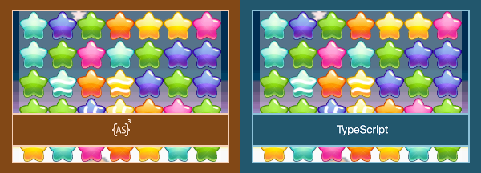

# 红姐大魔王 - 恐怖风格Match3游戏

基于网红事件"南京红姐"改编的恐怖风格Match3消除游戏，使用TypeScript和PixiJS开发，采用RobotlegsJS微架构设计。



## 🎮 游戏演示


## 🩸 恐怖特色

- **恐怖标题**: "红姐大魔王" Canvas自绘滴血字体效果
- **自定义棋子**: 19张个性化头像替换传统宝石
- **特殊效果**: 行消除、列消除、彩虹万能棋子带有独特视觉特效
- **暗黑氛围**: 恐怖背景色调和血红色主题
- **响应式布局**: 完美居中显示，适配各种屏幕

## 🛠️ 技术栈

- **开发语言**: TypeScript
- **图形引擎**: PixiJS
- **架构模式**: RobotlegsJS
- **构建工具**: Webpack
- **测试框架**: Karma + Mocha
- **部署平台**: Vercel

## 📁 项目结构

```
hongJieGame/
├── src/                    # 源代码
│   ├── index.ts           # 入口文件
│   ├── matchthree/        # 游戏核心逻辑
│   └── index.html         # HTML模板
├── assets/                # 游戏资源
│   ├── game_pieces/       # 自定义头像棋子
│   ├── backgrounds/       # 背景图片
│   └── fonts/            # 字体文件
├── test/                  # 测试文件
├── dist/                  # 构建输出
├── vercel.json           # Vercel部署配置
└── DEPLOYMENT.md         # 部署指南
```

## 🚀 快速开始

### 环境要求

- Node.js (推荐v14或更高版本)
- npm 或 yarn

### 安装依赖

```bash
npm install
```

### 启动开发服务器

```bash
npm start
```

游戏将在 `http://localhost:8080` 可用

### 构建生产版本

```bash
npm run build
```

### 部署到Vercel

```bash
npm run vercel-build
```

详细部署指南请参考 [DEPLOYMENT.md](DEPLOYMENT.md)

## 🎯 游戏规则

### 📋 基础玩法

#### 游戏目标
- 通过交换相邻棋子，形成3个或更多相同的棋子连线来消除它们
- 达到每关的目标分数获得星级评价
- 完成所有关卡挑战

#### 操作方式
1. **选择棋子**: 点击任意棋子进行选中
2. **交换棋子**: 点击相邻的棋子进行交换
3. **形成连线**: 3个或更多相同棋子连成直线即可消除
4. **连锁反应**: 消除后上方棋子下落，可能形成新的消除

#### 有效连线
- **水平连线**: 同一行3个或更多相同棋子
- **垂直连线**: 同一列3个或更多相同棋子
- **L型/T型**: 水平和垂直连线的组合

### ⚡ 特殊棋子系统

#### 🔶 行消除棋子 (橙色边框)
- **生成条件**: 4个相同棋子连成直线
- **特殊能力**: 消除整行所有棋子
- **视觉特征**: 橙色发光边框 + 水平箭头
- **激活方式**: 参与任意消除或被交换

#### 🟢 列消除棋子 (绿色边框)
- **生成条件**: 4个相同棋子连成直线
- **特殊能力**: 消除整列所有棋子
- **视觉特征**: 绿色发光边框 + 垂直箭头
- **激活方式**: 参与任意消除或被交换

#### 🌈 彩虹万能棋子 (彩虹边框)
- **生成条件**: 5个或更多相同棋子连成直线
- **特殊能力**: 
  - 可与任意棋子交换
  - 单独激活: 消除十字形区域(整行+整列)
  - 与普通棋子交换: 消除棋盘上所有该颜色的棋子
- **视觉特征**: 彩虹渐变边框 + 星星装饰

### 🔥 特殊组合效果

#### 超级组合
- **彩虹 + 彩虹**: 清除整个棋盘
- **行消除 + 列消除**: 产生大范围十字爆炸
- **彩虹 + 行/列消除**: 将该行/列转换为行/列消除棋子

#### 连锁反应
- 特殊棋子激活可能产生连锁消除
- 连锁消除会获得额外分数加成
- 多重连锁可以产生更多特殊棋子

### 🏆 评分系统

#### 基础得分
- **3连消除**: 100分
- **4连消除**: 200分 + 生成特殊棋子
- **5+连消除**: 300分 + 生成彩虹棋子

#### 特殊棋子得分
- **行消除激活**: 200分
- **列消除激活**: 200分
- **彩虹棋子激活**: 300分

#### 加分机制
- **连锁消除**: 每级连锁 +50% 分数加成
- **剩余步数**: 每剩余1步 +100分
- **时间奖励**: 快速完成额外加分

#### 星级评价
- ⭐ **1星**: 达到基础目标分数
- ⭐⭐ **2星**: 达到良好目标分数
- ⭐⭐⭐ **3星**: 达到完美目标分数

### 🎮 游戏模式

#### 关卡模式
- 多个精心设计的关卡
- 每关有不同的目标分数
- 逐步增加的难度曲线
- 星级评价系统

#### 挑战要素
- **限定步数**: 在有限步数内达到目标
- **特殊布局**: 不同的棋盘初始布局
- **障碍物**: 某些位置可能有特殊限制

### 💡 游戏技巧

#### 基础策略
1. **优先底部**: 从棋盘底部开始消除，利用重力产生连锁
2. **观察全局**: 寻找能产生多重消除的机会
3. **保存特殊棋子**: 在关键时刻使用特殊棋子

#### 高级技巧
1. **组合规划**: 计划特殊棋子的组合使用
2. **连锁设计**: 设计能产生长连锁的消除序列
3. **分数最大化**: 利用连锁加成获得更高分数

#### 特殊棋子使用
- **行/列消除**: 在棋子密集的行/列使用效果最佳
- **彩虹棋子**: 与数量最多的棋子颜色组合
- **组合使用**: 特殊棋子间的组合威力巨大

### 🎯 游戏特性

#### 核心玩法
- 经典Match3消除玩法
- 流畅的动画效果
- 智能的特殊棋子生成系统
- 完整的评分和星级系统

#### 恐怖元素
- 血红色"红姐大魔王"标题
- 暗色恐怖背景氛围
- 自定义头像棋子系统
- 特殊棋子视觉特效

#### 技术特色
- Canvas自绘文字效果
- 响应式设计
- 模块化架构
- 完整的测试覆盖

## 🎨 视觉特效系统

### 特殊棋子效果
- **行消除棋子**: 橙色发光边框 + 水平箭头
- **列消除棋子**: 绿色发光边框 + 垂直箭头  
- **彩虹万能棋子**: 多色渐变边框 + 星星装饰

### 恐怖文字渲染
- 自定义Canvas绘制系统
- 血液滴落效果
- 多层阴影渲染
- 字母扭曲变形

## 🌐 在线体验

- **生产环境**: [https://hong-jie-game.vercel.app](https://hong-jie-game.vercel.app)
- **开发分支**: [https://hong-jie-game-git-dev.vercel.app](https://hong-jie-game-git-dev.vercel.app)

## ⚠️ 免责声明

### 内容说明
本游戏基于网络热点事件"南京红姐"进行创意改编，采用恐怖风格设计。游戏内容纯属虚构，与现实人物、事件无关。

### 使用条款
- **仅供娱乐**: 本游戏仅用于娱乐和技术展示目的
- **禁止商用**: 严禁将本游戏用于任何商业用途
- **教育目的**: 可用于编程学习和技术交流
- **开源协议**: 遵循MIT开源协议

### 法律声明
- 游戏开发者不承担因使用本游戏而产生的任何法律责任
- 如有侵权或不当内容，请联系开发者及时处理
- 本游戏不代表开发者的政治立场或价值观念

### 适用人群
- 建议18岁以上用户游玩
- 对恐怖元素敏感者请谨慎体验
- 仅限具备独立判断能力的成年人使用

## 🤝 贡献指南

欢迎提交Issue和Pull Request来改进游戏：

1. Fork本仓库
2. 创建功能分支 (`git checkout -b feature/AmazingFeature`)
3. 提交更改 (`git commit -m 'Add some AmazingFeature'`)
4. 推送到分支 (`git push origin feature/AmazingFeature`)
5. 开启Pull Request

## 📄 开源协议

本项目采用 [MIT License](LICENSE) 开源协议。

## 👨‍💻 开发者

**HongJie Game Development Team**

- 游戏设计与开发
- 恐怖视觉效果设计
- 技术架构实现

---

**⚠️ 重要提醒**: 本游戏仅供娱乐和学习使用，请勿用于商业用途。如有任何问题或建议，欢迎通过GitHub Issues联系我们。